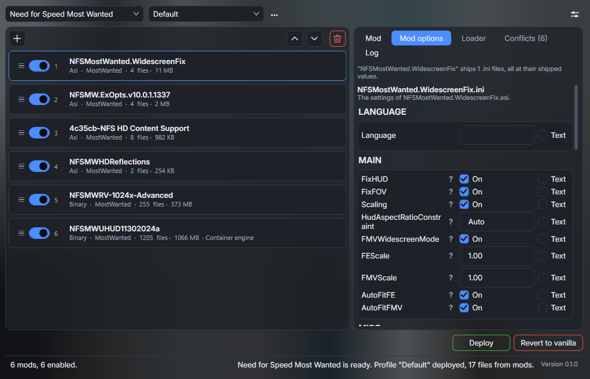

<p align="center">
  
</p>

<h1 align="center">BlackBox Mod Manager</h1>

A mod manager for the six Need for Speed games that EA Black Box developed. It installs mods
into a staging copy of the game, verifies the result, and then swaps that copy into place.

<p align="center">
  
</p>

<p align="center">
  <em>The main window. It shows the mod list, the load order, and the options of the selected mod.</em>
</p>

> **This project is not affiliated with, authorized by, or endorsed by Electronic Arts Inc.**
> Need for Speed and every game name below are trademarks of Electronic Arts Inc. This project
> names them to say which games it reads. It ships no game file and no game asset.
>
> This project is also not affiliated with the authors of Binary, Nikki, or Endscript. It uses
> those libraries under the MIT license. See [THIRD-PARTY-NOTICES.md](THIRD-PARTY-NOTICES.md).

## Games

| Game | Identifier |
| --- | --- |
| Need for Speed: Underground | `Underground1` |
| Need for Speed: Underground 2 | `Underground2` |
| Need for Speed: Most Wanted (2005) | `MostWanted` |
| Need for Speed: Carbon | `Carbon` |
| Need for Speed: ProStreet | `Prostreet` |
| Need for Speed: Undercover | `Undercover` |

## What it does

The application reads three kinds of mod and picks an engine for each kind.

| Kind | What it holds | How it installs |
| --- | --- | --- |
| Loose files | Files that replace files of the game | A hard link, a symbolic link, or a copy |
| ASI | A plugin that an ASI loader reads | The same way as a loose file |
| Binary | A `VERSN1` manifest and a `VERSN2` script | An edit of the game containers |

A profile holds the enabled mods, the load order, and every option answer. **A profile fully
determines the result of an install.** The application asks no question during a deploy.

### The install never writes to the game first

Every deploy follows one order, and the game directory changes only at the last step.

1. Record the vanilla state of the install, one time.
2. Build a staging copy from that vanilla copy.
3. Let each engine put its mods into the staging copy, in load order.
4. Verify the staging copy against the record.
5. Swap the staging copy into the game directory.

A failure at any step leaves the game directory untouched. `Revert` puts the vanilla state
back.

### Two routes for a Binary mod

A Binary mod runs an Endscript, and this application runs that script two ways. Choose the
route for each profile, and override it for one mod when you need to.

- **The container engine** runs Nikki and Endscript in this process. This is the default. It
  reports a library error directly, and it checks every command before it writes.
- **The Binary route** runs the Binary 2.8.3 program of the user instead. Use it for a mod that
  the container engine refuses. Read
  [docs/roadmap/15-binary-cli-route.md](docs/roadmap/15-binary-cli-route.md) for the limits.

## What you need

1. **Windows x64, or Wine.** The application is a WPF program, and it targets `net10.0-windows`
   with the `win-x64` runtime identifier.
2. **A Binary 2.8.3 install.** The application reads the `mainkeys/<game>.txt` hash lists from
   it. Those files ship with Binary and not with the MIT libraries, so a container edit needs
   them. Download Binary from [SpeedReflect/Binary](https://github.com/SpeedReflect/Binary).
3. **A game install.** Point the application at one, and it finds the rest.

**This project ships no part of Binary.** You install Binary yourself, and you name the
directory in the config window. The application reads the hash lists from that directory and
copies none of them.

### The .NET 10 Desktop Runtime

A release of this application is framework-dependent, so it needs that runtime.

- **On Windows, `Setup.exe` installs it for you.** You need to do nothing.
- **Under Wine, you install it into the prefix yourself.** The installer does not do it there.
  You can also build from source instead, because `tools/run-app.sh` publishes a self-contained
  build that carries the runtime with it.

### Binary 2.8.3 needs its own runtime

The Binary route starts `Binary.exe` as a separate process. That program needs the .NET Core
3.1 Desktop runtime, which is a different runtime from the one above. This application supplies
neither one. The container engine needs no runtime of its own.

## Install

Download the newest release from the
[releases page](https://github.com/PeterKelemen2/BlackBoxModManager/releases).

**The alpha releases are prereleases.** Read the state of the work below before you point this
application at a game that you care about.

Two files do the same job. Take one.

- **`Setup.exe`** installs the application for the current user and starts it. It asks no
  question and shows no wizard. Add `--silent` to install without the window. This is the only
  form that can update itself.
- **The portable zip** unpacks anywhere and runs from there. It checks for no update.

**Windows shows a SmartScreen warning on the first run.** These builds carry no code signature
yet. Choose "More info" and then "Run anyway".

The application installs under `%LOCALAPPDATA%`, and it keeps your data under
`%APPDATA%\BlackBoxModManager`. The two directories are separate on purpose, so an update and
an uninstall leave every mod, profile, and setting where it is.

### Updates

The application asks GitHub whether a newer release exists. It then downloads the release and
starts the new build. Your mods and profiles survive that.

**The check runs only when you ask for it.** Open the settings and press "Check now" in the
Updates group. Turn on "Check at start" in the same group to run the check at every start. That
check writes one line to the log and downloads nothing on its own.

A build that you compiled yourself carries no installer, so it cannot update itself. It says so
when you press the button.

## Build

Clone the repository with its submodules. The three MIT libraries are forks that target a
current .NET version.

```
git clone --recurse-submodules https://github.com/PeterKelemen2/BlackBoxModManager
cd BlackBoxModManager
dotnet build BlackboxModManager.slnx
```

`win-x64` is mandatory in every command below, because the code calls the x64
`LZCompressLib.dll` by name.

Publish a self-contained build to run the application without an installed runtime. A Wine user
wants this one, because the output carries the .NET runtime with it.

```
dotnet publish src/BlackboxModManager.App/BlackboxModManager.App.csproj -c Release -r win-x64 --self-contained true -o artifacts/app
```

`tools/run-app.sh` and `tools/run-app.ps1` publish and start the application in one step.

Build the release packages with `tools/pack.ps1`. This runs on Windows, and it needs the
Velopack CLI once: `dotnet tool install -g vpk`.

```
.\tools\pack.ps1 -Version 0.1.0-alpha.1
```

That script publishes framework-dependent, checks that every license file is in the output, and
writes `Setup.exe` and the portable zip into `artifacts/releases`. The release workflow runs the
same script. Read
[docs/roadmap/16-release-and-update.md](docs/roadmap/16-release-and-update.md) first.

Run the tests with this command.

```
dotnet test BlackboxModManager.slnx
```

**Some tests need the example mods.** Those mods belong to their authors, so this repository
does not carry them. Those tests report as skipped, and the rest of the suite passes. Put the
mods in an `example_mods` directory to run the whole suite.

## State of the work

The install path works for the three kinds of mod, for all six games. Read
[docs/roadmap/README.md](docs/roadmap/README.md) for the step sequence and for what each step
proved.

**Two parts need a run that nobody has made yet.** The Binary route has unit tests and no run
against a real Binary install. Step 7 proves the container work for Underground 2 alone.

## Documentation

| File | Holds |
| --- | --- |
| [project_brief.md](project_brief.md) | Format research and design decisions |
| [docs/roadmap/README.md](docs/roadmap/README.md) | The step sequence and the completed work |
| [docs/roadmap/16-release-and-update.md](docs/roadmap/16-release-and-update.md) | How a release goes out, and how the application updates itself |
| [docs/roadmap/98-known-upstream-defects.md](docs/roadmap/98-known-upstream-defects.md) | Defects in the MIT libraries that this project works around |
| [docs/roadmap/99-api-notes.md](docs/roadmap/99-api-notes.md) | Verified library signatures and call order |

## License

This project is under the MIT license. Read [LICENSE](LICENSE).

It ships other software, and each piece keeps its own license.
[THIRD-PARTY-NOTICES.md](THIRD-PARTY-NOTICES.md) names every one of them. It also names what
this project does not ship.

**Binary is GPL-3.0, and no file of it reaches a build of this project.** The Binary route
starts an unmodified program that the user installed. The GPL covers distribution and linking,
and this project does neither with Binary.
